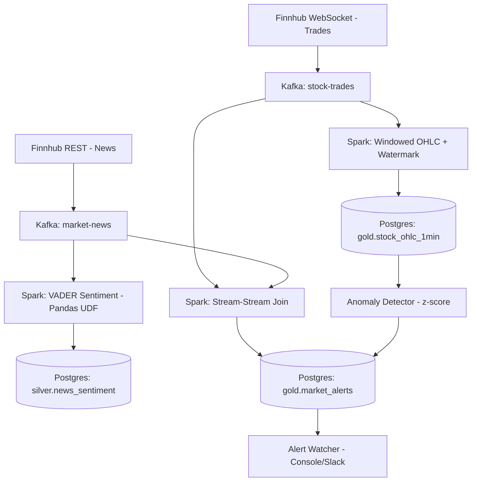

# AI/Tech Market Pulse — Real-Time Streaming Pipeline

A real-time streaming pipeline that ingests live stock trades and financial news for AI/tech bellwether stocks, processes both streams with Apache Spark Structured Streaming, and correlates price moves with news sentiment — the same pattern used in trading, risk, and fraud-detection systems.


## Architecture



## Features

- Two Kafka producers: live stock trades (WebSocket) and financial news (REST polling), with replay-mode fallback when markets are closed
- Spark Structured Streaming: 1-minute windowed OHLC + volatility aggregation, with watermarking for late data
- News sentiment scoring via VADER, using a Pandas UDF for vectorized performance
- Stream-stream join correlating trades with recent news, using watermarks on both sides
- Statistical anomaly detection (z-score) independent of news correlation
- Idempotent Postgres writes via `foreachBatch` + staging table + upsert
- One-command startup via Makefile

## Tech Stack

| Category | Tools |
|---|---|
| Languages | Python (producers, Spark jobs) |
| Streaming Broker | Apache Kafka (KRaft mode) |
| Stream Processing | Apache Spark Structured Streaming (PySpark) |
| Data Sources | Finnhub (WebSocket + REST) |
| Sentiment Scoring | VADER (nltk) |
| Storage | PostgreSQL (gold/silver schemas) |
| Infrastructure | Docker, Docker Compose |

## Quick Start

```bash
git clone <your-repo-url>
cd ai-market-pulse-streaming
cp .env.example .env  # fill in your Finnhub API key and Postgres credentials
make demo
```

This starts Kafka, both producers, all three Spark streaming jobs, and the alerting layer in one command. Check `logs/` for output, or `docker-compose ps` for container status.

## Project Structure
ai-market-pulse-streaming/
├── src/
│   ├── producers/       # Kafka producers (trades, news)
│   ├── streaming/        # Spark Structured Streaming jobs
│   └── utils/            # Alert watcher, anomaly detector
├── config/
│   └── tickers.yaml       # Ticker basket
├── docs/
│   ├── schemas.md         # Kafka topic schemas
│   └── screenshots/
├── docker-compose.yml
├── Makefile
└── requirements.txt


## Data Model

- **stock-trades / market-news** — raw Kafka topics (see `docs/schemas.md`)
- **gold.stock_ohlc_1min** — 1-minute OHLC + volume per ticker
- **silver.news_sentiment** — scored headlines
- **gold.market_alerts** — flagged alerts, tagged `news_correlated` or `statistical_anomaly`

## Data Quality & Design Notes

- Watermarking on both trade (2 min) and news (20 min) streams bounds how long Spark buffers state waiting for late data
- Idempotent upserts (`ON CONFLICT`) protect against duplicate writes on batch reprocessing
- See `docs/design_decisions.md` for the full ADR-style rationale, including deliberate simplifications (VADER over a finance-tuned model, Postgres over Iceberg/Delta Lake at this scale)

## What I Learned

- Kafka's `advertised.listeners` must resolve correctly for every network a client sits on — host machine vs. Docker-internal clients often need separate listener definitions
- `startingOffsets` semantics matter a lot for stream-stream joins — `latest` on both sides can silently prevent any match if the two streams' real-world timestamps don't overlap
- Streaming checkpoints can mask logic changes between runs during development — clear them when materially changing query semantics
- Pandas UDFs are a meaningful performance lever for any per-row text/ML scoring step in Spark

## Future Improvements

- Swap VADER for a finance-tuned sentiment model (e.g. FinBERT) for more accurate scoring on financial jargon
- Add Apache Iceberg or Delta Lake if this pipeline needed multi-engine access or cloud-scale storage
- Add a Schema Registry (Avro) for stronger topic contracts than `docs/schemas.md` alone
- Add a lightweight Streamlit view over the gold tables

## License

MIT